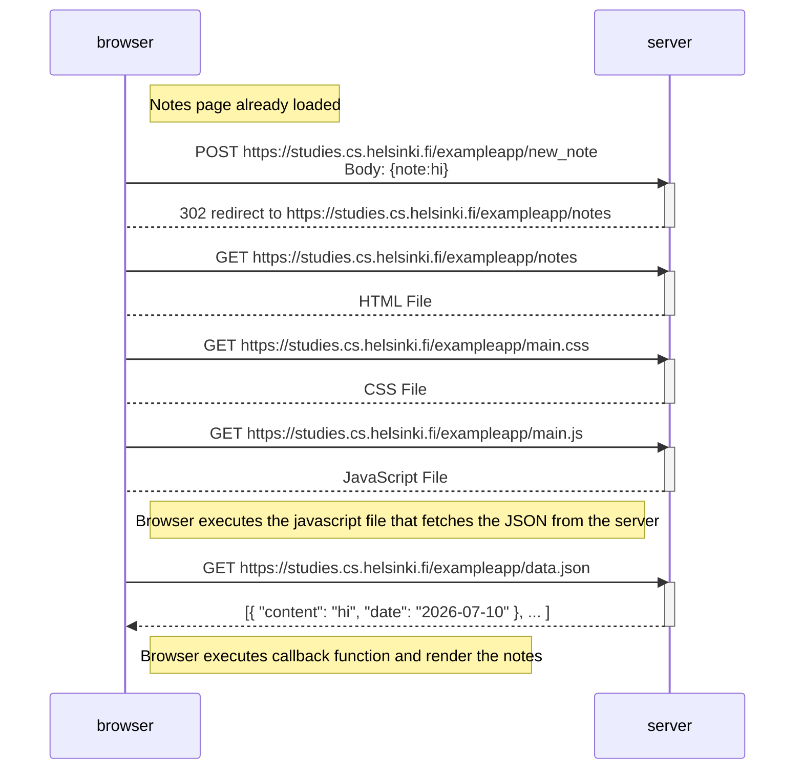

```mermaid
sequenceDiagram
  participant browser
  participant server

  Note right of browser: Notes page already loaded

  browser->>server: POST https://studies.cs.helsinki.fi/exampleapp/new_note <br> Body: {note:hi}
  activate server
  server-->browser: 302 redirect to https://studies.cs.helsinki.fi/exampleapp/notes
  deactivate server

 browser->>server: GET https://studies.cs.helsinki.fi/exampleapp/notes
  activate server
  server-->browser: HTML File
  deactivate server

 browser->>server: GET https://studies.cs.helsinki.fi/exampleapp/main.css
  activate server
  server-->browser: CSS File
  deactivate server

 browser->>server: GET https://studies.cs.helsinki.fi/exampleapp/main.js
  activate server
  server-->browser: JavaScript File
  deactivate server

  Note right of browser: Browser executes the javascript file that fetches the JSON from the server

  browser->>server: GET https://studies.cs.helsinki.fi/exampleapp/data.json
  activate server
  server-->>browser: [{ "content": "hi", "date": "2026-07-10" }, ... ]
  deactivate server

  Note right of browser: Browser executes callback function and render the notes
   
```
